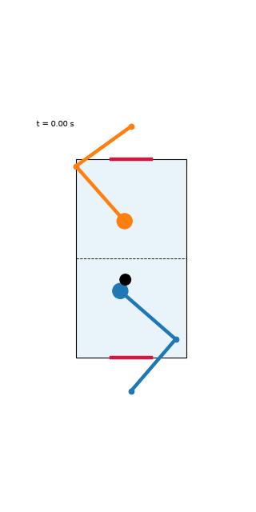
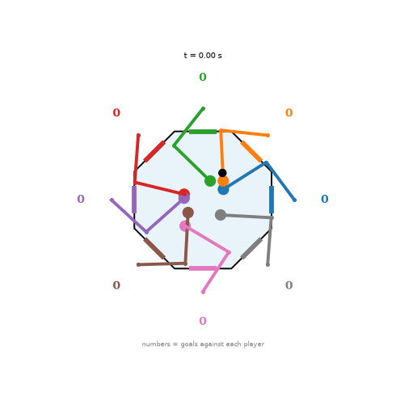

# MotorNet air hockey

Air hockey played by [MotorNet](https://github.com/OlivierCodol/MotorNet) arms, each driven by its own GRU policy and trained end to end with backpropagation through time. Each player is a `RigidTendonArm26` (6 lumped Hill muscles, 2-DoF arm). The puck, walls and mallet contacts are simulated with smooth penalty forces, so the whole game (muscles, skeletons, puck) is differentiable, and every policy descends its own, opposing loss. Contact forces are fed back to the arms as endpoint loads, so players feel the puck.

| Two players | Eight players on an octagon |
|:---:|:---:|
|  |  |

> Work in progress. The GIFs are the final policies of the latest runs (2-player 1500 iterations, octagon 1000 iterations; see [reports/2026-10-06_curriculum_runs.md](reports/2026-10-06_curriculum_runs.md)). The arms move but do not yet defend convincingly. Re-render from your own checkpoints, see below.

## Contents

| File | What it is |
|---|---|
| `motornet_air_hockey.ipynb` / `.py` | Two arms, one table. |
| `motornet_octagon_hockey.ipynb` / `.py` | Eight arms around an octagonal table, a goal on every side. The notebook trains in a detached background process and renders the video. |

The notebooks write their `.py` file themselves (`%%writefile`), and the `.py` files are also committed so they can be run from the command line.

Run reports live in [`reports/`](reports/); training curves and gifs are logged to Weights & Biases.

## Setup

Python 3.12 (PyTorch wheels may lag the newest Python releases).

```bash
python3.12 -m venv .venv && source .venv/bin/activate     # or: uv venv --python 3.12
pip install -r requirements.txt
python -m ipykernel install --user --name motornet --display-name "Python (MotorNet .venv)"
```

## Run

```bash
# two players
python motornet_air_hockey.py --resume                     # train, checkpoints to air_hockey.pt
python motornet_air_hockey.py --play air_hockey.pt         # writes air_hockey.mp4 and .gif

# eight players
python motornet_octagon_hockey.py --resume                 # train, checkpoints to octagon_hockey.pt
python motornet_octagon_hockey.py --play octagon_hockey.pt # writes octagon_hockey.mp4 and .gif
```

Add `--wandb <project> --run_name <name>` to either training script to log losses, goals, chase distance and mean muscle activation to Weights & Biases (`wandb login` first). Mean activation (`u_mean`) is worth watching: if it sits near 0 the arms are limp.

Training is CPU-bound by Python overhead (thousands of tiny sequential ops), so a GPU doesn't help and batch size is nearly free. Roughly 1 s/iteration for two players and 8 s/iteration for eight. `--resume` continues from the last checkpoint (saved every 25 to 50 iterations).

## How the game is set up

- **Two-player:** shoulders 1.2 m apart facing each other, goals in the end walls. The puck is launched from a wide area, aimed mostly along the long axis, so it doesn't just glide sideways. An optional brownian velocity jitter on the puck is available (`PUCK_NOISE`, off by default).
- **Octagon:** regular octagon with 0.45 m apothem, a 0.18 m goal in the middle of each side, and a player standing 0.6 m from the centre behind each goal. Every player sees the puck and all other hands in its own egocentric frame, with 20 ms proprioceptive and 50 ms visual delays.
- **Losses:** goals conceded, goals scored on others (octagon: shared among the other seven), puck territory, an early-training "chase the puck" shaping term that is annealed away, and a small effort penalty. The game terms are zero-sum across players.
- **Known simplifications:** mallets and arms don't collide with each other; only mallet-puck and puck-wall contacts are simulated. Hyperparameters are untuned and a full training run has not been completed, so don't expect polished play yet.

## Notes

- Written against `motornet` 0.3.0 (PyTorch).
- MotorNet quirk: `effector.to(device)` doesn't update the muscle's/skeleton's own `device`, so `Player.__init__` moves them explicitly.
- Each player's gradient also flows through the other players via the puck (implicit opponent shaping), and BPTT through repeated collisions is noisy. If training destabilises: shorter episodes, a softer `BETA`, or detaching the other players' observation inputs.
