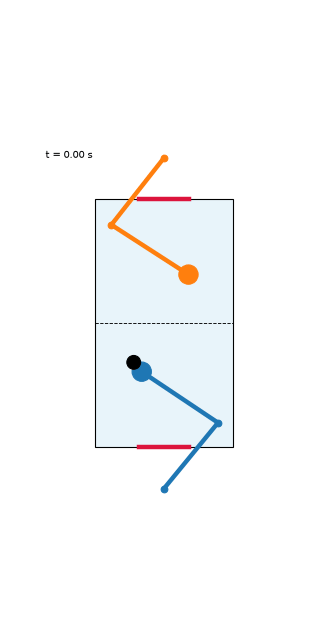

# Run report: 2-player with reach pretraining and truncated BPTT (2026-10-06)

**Result: the first run where the players actually play.** Both arms now move to the puck, follow it sideways and hit it, instead of idling. The octagon version of this recipe was still training when this report was written and will get its own report.

wandb: [2p-pretrain-tbptt](https://wandb.ai/bddepasq-boston-university/motornet-air-hockey/runs/rece49bg)



## What changed versus the previous runs

1. **The real problem was exploding gradients.** Measured on the same policy, the norm of the game-loss gradient over a 150-step episode was about 2e5 to 4e8 (even the effort penalty alone, which never touches the puck, went from 0.3 at 30 steps to 5e4 at 150 steps). After clipping to norm 1 the update direction was essentially noise, which explains why every earlier run drifted instead of learning, regardless of reward weights. Truncating BPTT every 30 steps (`--tbptt 30`) brings the same gradient down to about 2.5.
2. **Stage-0 reach pretraining** (`--pretrain_iters 600`). Each policy is trained alone on a "ghost" target (no puck, no contacts) that sits at a reachable point and moves at up to 0.4 m/s, with a dense per-step distance loss. Final reach error went from 0.24 m to 0.02 m.
3. **Puck-speed curriculum** over the first 400 game iterations, as before.
4. **Tonic output bias** `--out_bias -2.5` (motornet's default of -5 leaves the arms limp), and no puck jitter.

```
python motornet_air_hockey.py --iters 1000 --batch 256 --out_bias -2.5 \
  --pretrain_iters 600 --tbptt 30 --game_lr 5e-4 --curriculum_iters 400 \
  --chase_w0 10 --chase_floor 5 --effort 1e-3 --resume \
  --wandb motornet-air-hockey --run_name 2p-pretrain-tbptt --video_every 150
```

I did not run ablations, so I can't say how much each of the changes contributes on its own. A previous run with pretraining but without truncated BPTT lost the reach skill completely within the game stage (reach error went from 0.02 m back to 0.3 to 0.5 m), which points at the gradient explosion as the main culprit.

## Behaviour analysis

From `analyze_play.py`, 30 games of 4 s each, truncated at the first goal. Frames where the puck is on the player's own side. `hand->puck` is the mean mallet-to-puck distance; `idle->puck` is the same if the mallet had stayed at rest; `track r` is the correlation between mallet and puck lateral position.

| player | puck on side | hand->puck (m) | idle->puck (m) | track r | speed (m/s) | touches/min | goals against/min |
|---|---|---|---|---|---|---|---|
| A | 63% | 0.126 | 0.170 | 0.63 | 1.39 | 40.2 | 5.6 |
| B | 37% | 0.150 | 0.196 | 0.50 | 1.32 | 28.2 | 4.9 |

Both hands are now closer to the puck than the idle baseline (previously 2x farther), follow it laterally (r of 0.5 to 0.6, previously about 0), move at over 1 m/s, and touch the puck 30 to 40 times a minute (previously 1 to 3). Goals are scored frequently, about 5 per minute against each side, so the game is lively but not yet defensive: players hit the puck hard and often into either goal.

After the game stage the policies still reach a ghost target to within 0.07 to 0.10 m (from 0.02 m at the end of pretraining), so some of the isolated reach skill was lost but most of it was kept.

## Caveats

- Single seed, 30 short games, no ablations.
- The two players' numbers in this analysis tell us they engage with the puck, not that either is good at defending: the goal rate against each is high.
- In the 2-player rollout the puck is not respawned after a goal, so the GIF can show the puck sitting past a goal line.

## Next

- Run the octagon version with the same recipe (in progress).
- Add a defensive objective or a penalty for conceding that is felt earlier, since reaching and hitting are learned but protecting the goal is not yet.
- Ablate truncated BPTT alone (no pretraining) to see whether pretraining is needed once gradients are stable.
