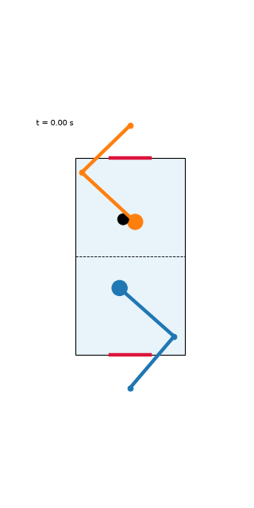
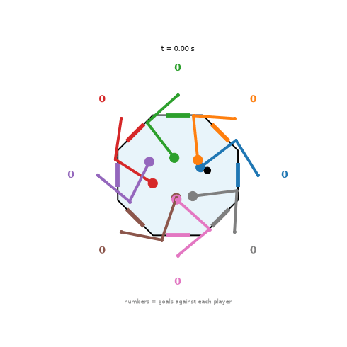

# Run report: puck-speed curriculum, 2-player and octagon (2026-10-06)

Both runs are the first with the full set of fixes found while debugging (tonic output bias, puck-speed curriculum, no puck jitter). Neither learned convincing defensive play; the octagon run shows some weak signs.

| | 2-player | Octagon (8 players) |
|---|---|---|
| wandb | [2p-curriculum](https://wandb.ai/bddepasq-boston-university/motornet-air-hockey/runs/0l0wyhq0) | [octagon-curriculum](https://wandb.ai/bddepasq-boston-university/motornet-air-hockey/runs/0xosi119) |
| iterations / batch | 1500 / 256 | 1000 / 128 |
| episode length | 150 steps (1.5 s) | 120 steps (1.2 s) |
| final policy |  |  |

## Settings

```
--out_bias -2.5          # motornet's default -5 leaves the muscles off and the arms limp
--curriculum_iters N     # puck launch speed ramps from 0 to full: N = 700 (2p), 500 (octagon)
--chase_w0 10 --chase_floor 5   # chase-shaping weight, annealed over the first 60% of iterations
--effort 1e-3
PUCK_NOISE = 0           # no brownian jitter on the puck
```

Everything else is the script default (lr 1e-3, hidden 128, motor noise 0.01, seed 0).

## Behaviour analysis

From `analyze_play.py` over recorded games, frames where the puck is on the player's own side.
`hand->puck` is the mean distance from mallet to puck; `idle->puck` is the same distance if the mallet had stayed at its rest position, so a player that is moving toward the puck should have `hand->puck` below `idle->puck`. `track r` is the correlation between the mallet's and the puck's lateral position (positive means the hand follows the puck sideways).

### 2-player (30 games x 4 s)

| player | puck on side | hand->puck (m) | idle->puck (m) | track r | speed (m/s) | touches/min |
|---|---|---|---|---|---|---|
| A | 55% | 0.283 | 0.161 | 0.07 | 0.10 | 2.5 |
| B | 45% | 0.299 | 0.153 | 0.02 | 0.08 | 1.0 |

Both hands end up farther from the puck than if they had sat still, do not follow it sideways, and move slowly. This is better than the earlier no-curriculum run (hand->puck about 0.45 to 0.5 m) but is not defending.

### Octagon (20 games x 4 s)

| player | puck on side | hand->puck (m) | idle->puck (m) | track r | speed (m/s) | touches/min | goals against/min |
|---|---|---|---|---|---|---|---|
| 0 | 13% | 0.200 | 0.141 | -0.01 | 0.10 | 0.0 | 1.5 |
| 1 | 6% | 0.458 | 0.188 | -0.21 | 0.16 | 2.2 | 0.0 |
| 2 | 6% | 0.239 | 0.102 | -0.08 | 0.10 | 1.5 | 0.0 |
| 3 | 12% | 0.271 | 0.078 | 0.19 | 0.09 | 1.5 | 0.8 |
| 4 | 16% | 0.156 | 0.182 | -0.04 | 0.10 | 0.8 | 0.0 |
| 5 | 12% | 0.188 | 0.150 | 0.08 | 0.23 | 0.0 | 0.8 |
| 6 | 20% | 0.161 | 0.177 | -0.07 | 0.08 | 0.8 | 0.8 |
| 7 | 14% | 0.163 | 0.197 | 0.23 | 0.11 | 1.5 | 0.8 |

Players 4, 6 and 7 hold their hand slightly closer to the puck than the idle baseline, and players 3 and 7 have a positive tracking correlation (0.19 and 0.23), so there is a hint of some players moving to meet the puck. The effect is small, rests on 20 short games, and most players are still idle or moving away from the puck. Goals per training episode ended at 0.2, down from a peak of about 0.6 in the middle of the run, but that may reflect arms getting in the way as much as defence.

## Training curves (from the logs)

| iteration | 2p chase A / B | octagon chase | octagon goals/episode |
|---|---|---|---|
| 0 | 0.144 / 0.145 | 0.034 | 0.09 |
| 500 | 0.146 / 0.159 | 0.072 | 0.57 |
| 1000 | 0.142 / 0.159 | n/a (ended 995: 0.034) | 0.20 (at 995) |

In the 2-player run, chase fell during the stationary-puck phase in short tests, then rose again as the puck sped up. Full curves, per-player losses, mean muscle activation (`u_mean`) and gifs every 100 to 150 iterations are in the wandb runs above.

## Takeaways

- Fixing the output bias keeps the arms from going limp, which was the first-order problem in the earlier runs (mean activation was about 0.01 before).
- The curriculum teaches reaching to a stationary puck but the skill does not transfer well once the puck moves at game speed.
- Next: pretrain each policy with a direct per-step reach target, use shorter early episodes, and consider giving the policy a predicted intercept point.
