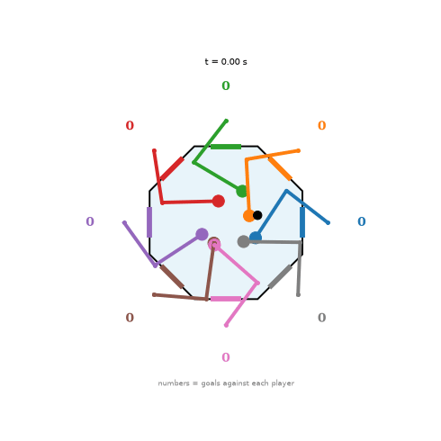

# Run report: octagon with reach pretraining and truncated BPTT (2026-10-06)

Same recipe as the [2-player run](2026-10-06_2p_pretrain_tbptt.md), applied to eight players. **Result: the arms are now very active and hit the puck often, but they do not yet move purposefully toward it.**

wandb: [octagon-pretrain-tbptt](https://wandb.ai/bddepasq-boston-university/motornet-air-hockey/runs/sos1lvzl)



```
python motornet_octagon_hockey.py --iters 1000 --batch 128 --out_bias -2.5 \
  --pretrain_iters 400 --tbptt 30 --game_lr 5e-4 --curriculum_iters 400 \
  --chase_w0 10 --chase_floor 5 --effort 1e-3 --resume \
  --wandb motornet-air-hockey --run_name octagon-pretrain-tbptt --video_every 100
```

Stage 0 (reach pretraining) brought the mean final reach error from 0.33 m to 0.025 m for all eight players. About 8 s per game iteration, 1000 iterations.

## Behaviour analysis

`analyze_play.py`, 20 games of 4 s. Frames where the puck is on the player's own side (which is only 9 to 16% of frames, since the puck is spread over eight sides).

| player | puck on side | hand->puck (m) | idle->puck (m) | track r | speed (m/s) | touches/min | goals against/min |
|---|---|---|---|---|---|---|---|
| 0 | 9% | 0.216 | 0.165 | -0.01 | 2.73 | 22.5 | 3.0 |
| 1 | 10% | 0.255 | 0.155 | 0.08 | 2.59 | 10.5 | 8.2 |
| 2 | 16% | 0.219 | 0.159 | 0.13 | 2.23 | 21.8 | 4.5 |
| 3 | 16% | 0.235 | 0.159 | 0.29 | 3.20 | 33.8 | 6.8 |
| 4 | 13% | 0.202 | 0.156 | 0.13 | 1.77 | 18.0 | 6.0 |
| 5 | 12% | 0.245 | 0.169 | 0.24 | 2.54 | 32.2 | 8.2 |
| 6 | 12% | 0.270 | 0.166 | 0.08 | 3.29 | 33.0 | 7.5 |
| 7 | 11% | 0.178 | 0.160 | 0.12 | 2.13 | 12.8 | 6.0 |

- Compared with the earlier octagon runs (speeds around 0.1 m/s and 0 to 4 touches per minute), every player now moves fast and touches the puck 10 to 34 times a minute.
- Tracking correlations are mostly small and positive (0.08 to 0.29, player 3 highest); hands stay about as far from the puck as if they had sat at rest. Together with speeds of 2 to 3 m/s this looks like vigorous swinging that hits the puck often, not deliberate interception.
- Goals against are high (3 to 8 per minute per player), so there is no defence yet.

## Caveats

- Single seed, 20 short games, no ablations; the `idle->puck` baseline is less informative with eight players than with two.
- The octagon is a harder credit-assignment problem: each player's loss depends on seven others through the puck, and each goal is shared among the other seven players.

## Next

- Longer training or a larger batch; the 2-player run needed the same recipe but only two opponents.
- Reduce the shared-goal dilution (reward scoring more directly), and add an explicit defensive term (e.g. penalise the puck's distance to the player's own goal, not only goals conceded).
- Ablate truncated BPTT alone.
